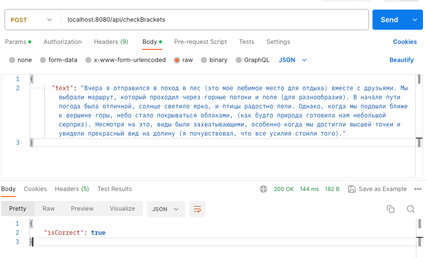
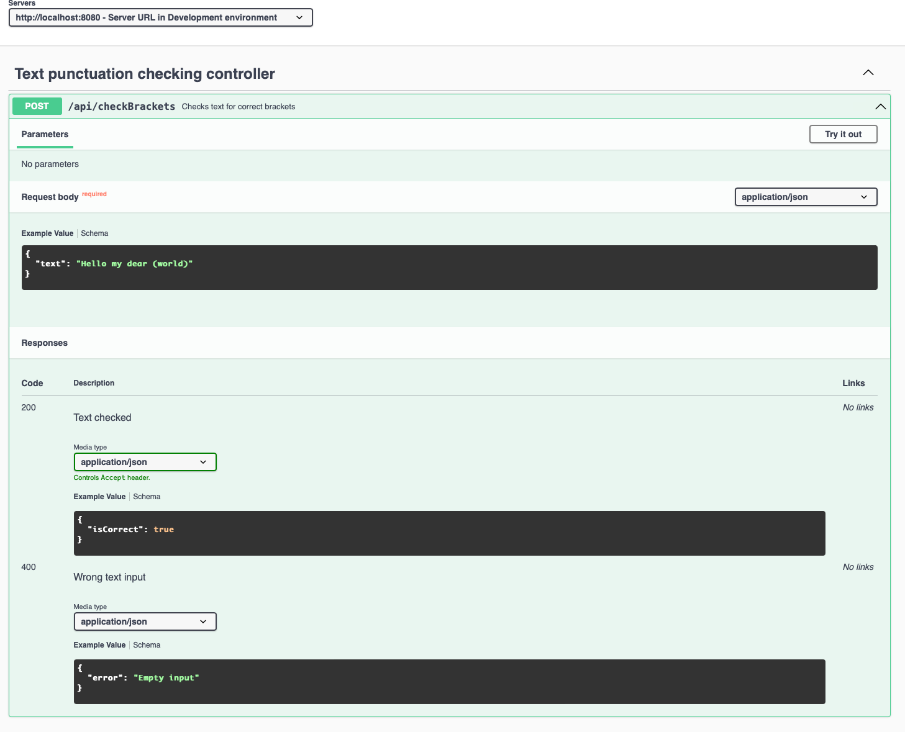

# <a href='https://github.com/Muryginds/BeatifulCodeContest'>Text punctuation checker</a>

### An application that helps people determine whether they have correctly placed parentheses in their text

Default address http://localhost:8080

Features implemented:

- Rest controller for handling incoming request
- Separated service for business logic
- Tests for both controller and service
- Incoming requests validation and controller advice for error handling
- Lombok for boilerplate code reduction
- API documented with swagger-ui

POST request example: /api/checkBrackets



API documentation http://localhost:8080/swagger-doc



Technology stack:

- Spring Boot 3.0.3 (Web, Test, Validation)
- Lombok
- Swagger 3

To run the project follow next steps:

- download project files
- open terminal inside root folder
- create package using following commands(make sure maven is installed):
    ```agsl
    mvn clean package
    ```
- run project using next command
    ```agsl
    java -jar target/TextCheckup-0.0.1-SNAPSHOT.jar
    ```